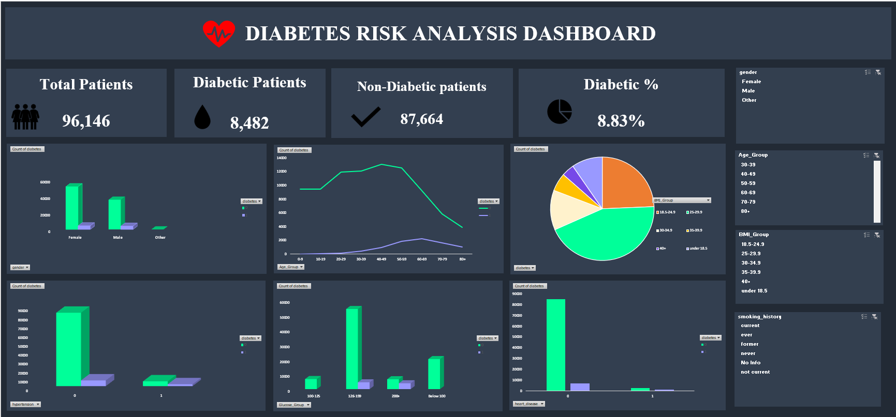

## 📌 Project Overview

Diabetes Risk Analysis is an interactive data analysis project developed using Microsoft Excel.

The project analyses diabetes-related data to understand how diabetes is distributed across different demographic and health-related factors.

## 🎯 Objective

The main objective of this project is to analyse diabetes patterns across:

- Gender
- Age Group
- BMI Group
- Smoking History
- Hypertension
- Blood Glucose Level

## 🛠️ Tools & Technologies

- Microsoft Excel
- Power Query
- Pivot Tables
- Pivot Charts
- Slicers
- Excel Dashboard

## 📊 Dashboard

The project includes an interactive dashboard with:

- KPI Cards
- Interactive Slicers
- Gender-wise Diabetes Analysis
- Age Group-wise Analysis
- BMI Group Analysis
- Blood Glucose Analysis
- Health-related factor analysis

## 🔍 Key Analysis

The dashboard allows users to explore diabetes distribution across different patient segments using interactive slicers.

Users can filter the analysis by:

- Gender
- Age Group
- BMI Group
- Smoking History

This helps in identifying patterns in diabetes across different demographic and health-related categories.

## 🔄 Project Workflow

Raw Data  
↓  
Data Cleaning using Power Query  
↓  
Data Transformation  
↓  
Pivot Table Analysis  
↓  
Pivot Charts  
↓  
Interactive Slicers  
↓  
Dashboard

## 📁 Project Files

**Diabetes_Risk_Analysis.xlsx**  
Complete Excel project containing the cleaned data, Pivot Tables, Pivot Charts, Slicers and interactive dashboard.

**Dashboard.png**  
Preview image of the final dashboard.

## 👩‍💻 Project Type

Data Analysis | Excel Dashboard | Business Intelligence
